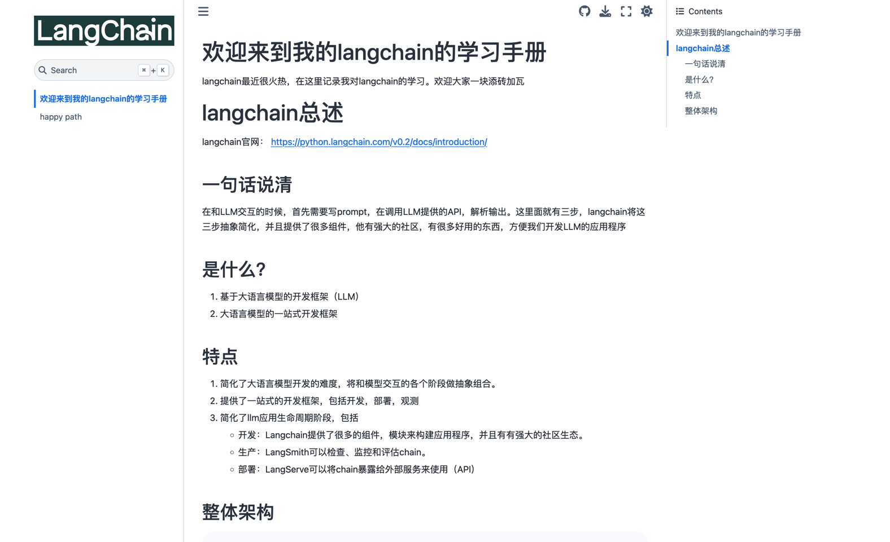

# 欢迎来到我的langchain的学习手册

langchain最近很火热，在这里记录我对langchain的学习。
欢迎大家一块添砖加瓦

# 构建
```shell
export  OPENAI_API_KEY="xxx"
export  OPENAI_API_BASE="xxx"

jupyter-book build  .
```
You can now access _build/html/index.html and enjoy!



# plans
1. ~~列举基本知识点，model，Prompt。outputParser~~
2. chain的类型，和文本的结合，问答，汇总，路由链
   1. ~~chain类型~~
   2. 问答
   3. 汇总
   4. 路由
   5. 单测
3. ~~记忆的存储~~
4. agent的入门，langGraph的的使用
5. 一些有趣的例子