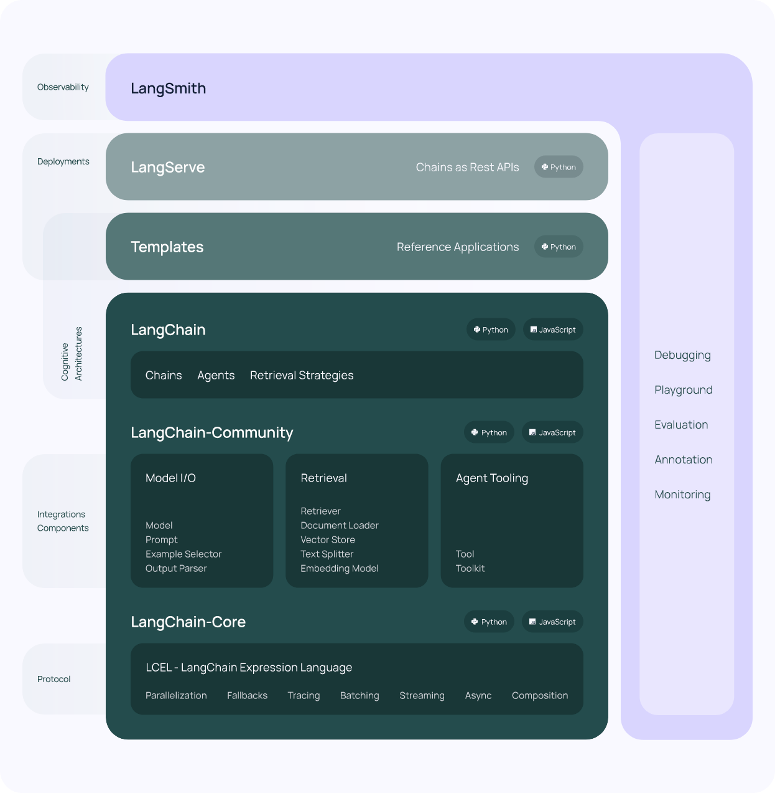

# 欢迎来到我的langchain的学习手册

langchain最近很火热，在这里记录我对langchain的学习。
欢迎大家一块添砖加瓦

# langchain总述

langchain官网：
https://python.langchain.com/v0.2/docs/introduction/

## 一句话说清
在和LLM交互的时候，首先需要写prompt，在调用LLM提供的API，解析输出。这里面就有三步，langchain将这三步抽象简化，并且提供了很多组件，他有强大的社区，
有很多好用的东西，方便我们开发LLM的应用程序

## 是什么？
1. 基于大语言模型的开发框架（LLM）
2. 大语言模型的一站式开发框架

## 特点
1. 简化了大语言模型开发的难度，将和模型交互的各个阶段做抽象组合。
2. 提供了一站式的开发框架，包括开发，部署，观测
3. 简化了llm应用生命周期阶段，包括
   - 开发：Langchain提供了很多的组件，模块来构建应用程序，并且有有强大的社区生态。
   - 生产：LangSmith可以检查、监控和评估chain。
   - 部署：LangServe可以将chain暴露给外部服务来使用（API）

## 整体架构

如上图所示，langchain的库如下
1. `langchain-core`
   对langchain的基础抽象和langchain表达式
2. `langchain-community`
   和第三方的整合（langchain是基于LLM的开发框架，他本身并不提供关于LLM的能力，它只是简化了和LLM交互的难度）
   和一些模型的包（例如，langchain-openai、langchain-anthropic等），一些集成已经进一步分离为只依赖于langchain-core的独立轻量级包。
3. `langchain`
   Chains、agents、和让应用程序有认知能力的检索策略（retrieval strategies）
4. `langgraph`
   通过将步骤建模为图中的边和节点，使用LLM构建健壮且有状态的多参与者应用程序。
5. `langserve`
   将chain变为REST APIs
6. `LangSmith`
   一个开发者平台，让你调试、测试、评估和监控LLM应用程序。